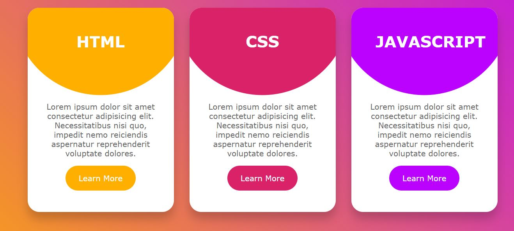

# Hover-Card-Effect

This is a design of Background Blur Card Animation on hover effect.

## Table of contents

- [Overview](#overview)
  - [The challenge](#the-challenge)
  - [Screenshot](#screenshot)
  - [Links](#links)
- [My process](#my-process)
  - [Built with](#built-with)
  - [What I learned](#what-i-learned)
- [Author](#author)

## Overview

### The challenge

Users should be able to:

- View the optimal animation on hovering your mouse to the card
- See hover states for all interactive elements on the page

### Screenshot

- Normal View - Hover View

### Links

- Solution URL: [Github](https://github.com/zaidansari42/BG-Blur-Card-Hover-Effect/)
- Live Site URL: [Live Website](https://zaidansari42.github.io/BG-Blur-Card-Hover-Effect/)

## My process

### Built with

- Semantic HTML5 markup
- CSS custom properties
- Flexbox
- Transform Scaling

### What I learned

I learned how to create a beautiful card with only HTML & CSS.

```html
<div class="context">
  <p>
    Lorem ipsum dolor sit amet consectetur adipisicing elit. Necessitatibus nisi
    quo, impedit nemo reiciendis aspernatur reprehenderit voluptate dolores.
  </p>
  <a href="#">Learn more</a>
</div>
```

```css
.circle {
  position: relative;
  height: 100%;
  width: 100%;
  background: #000;

  clip-path: circle(180px at center 0);
}
```

## Author

- Website - [Zaid Ansari](https://github.com/zaidansari42/)
- Twitter - [@zaidnasari42](https://www.twitter.com/zaidnasari42)
